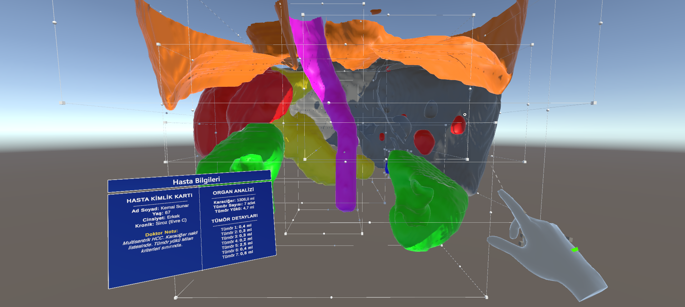

# SurgScanVR - Medical Image Segmentation with VR Visualization

A medical imaging application that combines AI-powered organ segmentation with Virtual Reality visualization for surgical planning and education.


*Figure 1: SurgScanVR Main Application Interface*

## 🔬 Features

- **AI-Powered Segmentation**: Uses nnU-Net v2 for accurate multi-organ segmentation from CT/MRI scans
- **3D Mesh Generation**: Converts segmentation results to 3D meshes using marching cubes algorithm
- **VR Integration**: Sends 3D organ models to Unity-based VR application via TCP
- **Volume Analysis**: Calculates liver and tumor volumes with connected component analysis
- **Patient Records**: Saves patient information and analysis results as JSON records
- **Caching System**: File-based prediction cache to avoid re-processing
- **Modern GUI**: Tkinter-based interface with dark theme


*Figure 2: System Architecture and Data Pipeline*
## 📁 Project Structure

```
SurgScanVR/
├── AI_Backend/
│   ├── run.py                    # Application entry point
│   └── inference_app/
│       ├── __init__.py           # Package initialization
│       ├── app.py                # Main GUI application
│       ├── config.py             # Constants and configuration
│       ├── cache.py              # Prediction caching
│       ├── volume.py             # Volume calculation
│       ├── patient.py            # Patient record management
│       ├── network.py            # Unity TCP communication
│       └── engine.py             # nnU-Net inference engine
├── VR_Frontend/                  # Unity VR application
│   ├── Assets/
│   ├── Packages/
│   └── ProjectSettings/
├── README.md
├── requirements.txt
├── LICENSE
└── .gitignore
```

## 🚀 Installation

### Prerequisites

- Python 3.9 or higher
- CUDA-capable GPU (recommended for faster inference)
- Unity 2021.3 LTS or higher (for VR frontend)
- VR headset compatible with Unity XR (optional)

### Python Backend Setup

1. **Clone the repository**
   ```bash
   git clone https://github.com/yourusername/SurgScanVR.git
   cd SurgScanVR
   ```

2. **Create a virtual environment**
   ```bash
   python -m venv venv
   
   # Windows
   venv\Scripts\activate
   
   # Linux/macOS
   source venv/bin/activate
   ```

3. **Install dependencies**
   ```bash
   pip install -r requirements.txt
   ```

4. **Install PyTorch with CUDA support** (recommended for GPU acceleration)
   ```bash
   # Check https://pytorch.org/get-started/locally/ for the correct command
   pip install torch torchvision torchaudio --index-url https://download.pytorch.org/whl/cu118
   ```

5. **Setup the nnU-Net Model**
   
   This project uses a pre-trained model for liver and lesion segmentation.
   
   - **Download the model**: [Pretrained model for 3D semantic image segmentation of the liver and liver lesions](https://doi.org/10.5281/zenodo.11582728)
   - **Supported Format**: The model is designed to work with NIfTI files (`.nii` or `.nii.gz`).
   - **Directory Structure**: Ensure your model folder has the exact structure shown below (including folds and JSON files):

     ```text
     ```text
     Model_Folder/
     ├── fold_0/
     │   └── checkpoint_final.pth
     ├── fold_1/
     │   └── checkpoint_final.pth
     ├── fold_2/
     │   └── checkpoint_final.pth
     ├── fold_3/
     │   └── checkpoint_final.pth
     ├── fold_4/
     │   └── checkpoint_final.pth
     ├── dataset.json
     ├── dataset_fingerprint.json
     └── plans.json
     ```
   
   - **Configuration**: Point the application to this `Model_Folder` in the GUI.

### Unity VR Frontend Setup

1. **Open Unity Hub** and add the `VR_Frontend` folder as a project

2. **Install required packages** (if not already installed):
   - XR Plugin Management
   - OpenXR Plugin (or your VR platform's plugin)

3. **Configure XR settings** for your VR headset

4. **Open the main scene** and press Play to start the TCP server

## 📖 Usage

### Running the Application

1. **Start the Python backend**
   ```bash
   cd AI_Backend
   python run.py
   ```

2. **Configure the application**:
   - **Model**: Select your nnU-Net model folder
   - **Image**: Select a NIfTI (.nii or .nii.gz) CT/MRI scan
   - **Output**: Choose the output directory for predictions

3. **Enter patient information** (optional):
   - Patient name, age, gender
   - Chronic diseases
   - Doctor notes

4. **Click "PREDICT"** to run the segmentation

5. **Review results**:
   - Liver volume (ml)
   - Tumor count and volumes

6. **Send to VR** (optional):
   - Ensure Unity application is running
   - Click "SEND TO VR" to transfer 3D models

### Supported Organs

The system segments the following structures:
- Spleen, Kidneys, Pancreas
- Stomach, Heart, Duodenum
- Liver, Tumor

## ⚙️ Configuration

### Unity Connection

- **Default Host**: 127.0.0.1 (localhost)
- **Default Port**: 5555

Configure in the Unity Settings section of the GUI.

### Caching

Enable/disable prediction caching in the Unity Settings section. Cached results are stored in `prediction_cache/`.

## 🔧 Technical Details

- **Segmentation Model**: nnU-Net v2
- **3D Mesh Generation**: Marching cubes (scikit-image) + Laplacian smoothing (trimesh)
- **Network Protocol**: Custom TCP with struct-packed binary data
- **GUI Framework**: Tkinter with ttk widgets

## 🤝 Contributing

1. Fork the repository
2. Create a feature branch (`git checkout -b feature/amazing-feature`)
3. Commit your changes (`git commit -m 'Add amazing feature'`)
4. Push to the branch (`git push origin feature/amazing-feature`)
5. Open a Pull Request

## 👥 Authors

* **Yusuf Said Samur** - [GitHub](https://github.com/yusufsamur)
* **Yiğit Demirbağ** - [GitHub](https://github.com/yigitdmrb)

## 📄 License

This project is licensed under the MIT License - see the [LICENSE](LICENSE) file for details.

## 📧 Contact

For questions or feedback, please open an issue on GitHub.

## 🙏 Acknowledgements

- **Pre-trained Model**:
  > Murugesan, G. K., Van Oss, J., & McCrumb, D. (2024). Pretrained model for 3D semantic image segmentation of the liver and liver lesions from ct scan (v1.0.0). Zenodo. [https://doi.org/10.5281/zenodo.11582728](https://doi.org/10.5281/zenodo.11582728)
  > 

- [nnU-Net](https://github.com/MIC-DKFZ/nnUNet) - Self-configuring medical image segmentation
- [nibabel](https://nipy.org/nibabel/) - NIfTI file handling
- [trimesh](https://trimsh.org/) - 3D mesh processing
- Unity Technologies - VR development platform
